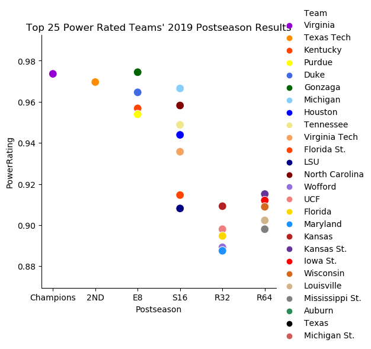
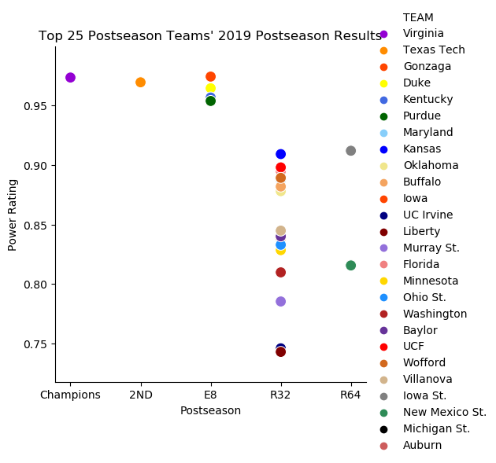
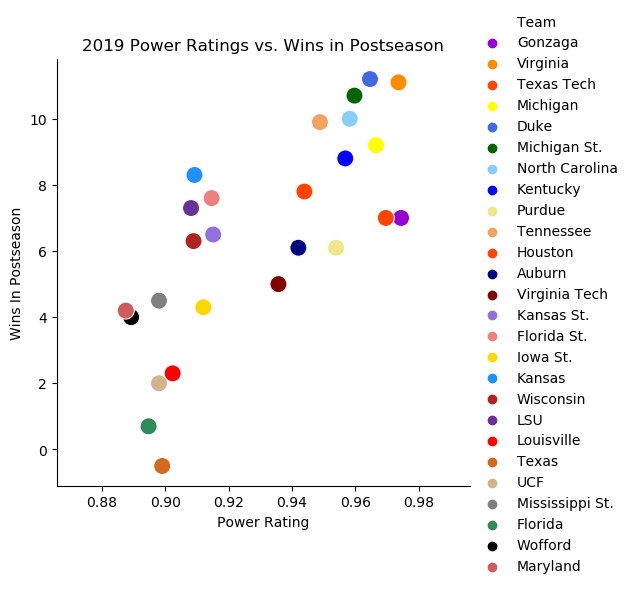

# Analysis of 2019 NCAA College Basketball Season

## Stephanie Fissel

## Import packages


```python
import pandas as pd
import matplotlib.pyplot as plt
import numpy as np
import seaborn as sns
```

## Read in 2019 college basketball CSV file


```python
cbb19 = pd.read_csv('/Users/stephaniefissel/Downloads/archive (12)/cbb19.csv')
```


```python
cbb19.shape
```


    (353, 23)


```python
cbb19.head()
```


<div>
<style scoped>
    .dataframe tbody tr th:only-of-type {
        vertical-align: middle;
    }

    .dataframe tbody tr th {
        vertical-align: top;
    }

    .dataframe thead th {
        text-align: right;
    }
</style>
<table border="1" class="dataframe">
  <thead>
    <tr style="text-align: right;">
      <th></th>
      <th>TEAM</th>
      <th>CONF</th>
      <th>G</th>
      <th>W</th>
      <th>ADJOE</th>
      <th>ADJDE</th>
      <th>BARTHAG</th>
      <th>EFG_O</th>
      <th>EFG_D</th>
      <th>TOR</th>
      <th>...</th>
      <th>FTR</th>
      <th>FTRD</th>
      <th>2P_O</th>
      <th>2P_D</th>
      <th>3P_O</th>
      <th>3P_D</th>
      <th>ADJ_T</th>
      <th>WAB</th>
      <th>POSTSEASON</th>
      <th>SEED</th>
    </tr>
  </thead>
  <tbody>
    <tr>
      <th>0</th>
      <td>Gonzaga</td>
      <td>WCC</td>
      <td>37</td>
      <td>33</td>
      <td>123.4</td>
      <td>89.9</td>
      <td>0.9744</td>
      <td>59.0</td>
      <td>44.2</td>
      <td>14.9</td>
      <td>...</td>
      <td>35.3</td>
      <td>25.9</td>
      <td>61.4</td>
      <td>43.4</td>
      <td>36.3</td>
      <td>30.4</td>
      <td>72.0</td>
      <td>7.0</td>
      <td>E8</td>
      <td>1.0</td>
    </tr>
    <tr>
      <th>1</th>
      <td>Virginia</td>
      <td>ACC</td>
      <td>38</td>
      <td>35</td>
      <td>123.0</td>
      <td>89.9</td>
      <td>0.9736</td>
      <td>55.2</td>
      <td>44.7</td>
      <td>14.7</td>
      <td>...</td>
      <td>29.1</td>
      <td>26.3</td>
      <td>52.5</td>
      <td>45.7</td>
      <td>39.5</td>
      <td>28.9</td>
      <td>60.7</td>
      <td>11.1</td>
      <td>Champions</td>
      <td>1.0</td>
    </tr>
    <tr>
      <th>2</th>
      <td>Duke</td>
      <td>ACC</td>
      <td>38</td>
      <td>32</td>
      <td>118.9</td>
      <td>89.2</td>
      <td>0.9646</td>
      <td>53.6</td>
      <td>45.0</td>
      <td>17.5</td>
      <td>...</td>
      <td>33.2</td>
      <td>24.0</td>
      <td>58.0</td>
      <td>45.0</td>
      <td>30.8</td>
      <td>29.9</td>
      <td>73.6</td>
      <td>11.2</td>
      <td>E8</td>
      <td>1.0</td>
    </tr>
    <tr>
      <th>3</th>
      <td>North Carolina</td>
      <td>ACC</td>
      <td>36</td>
      <td>29</td>
      <td>120.1</td>
      <td>91.4</td>
      <td>0.9582</td>
      <td>52.9</td>
      <td>48.9</td>
      <td>17.2</td>
      <td>...</td>
      <td>30.2</td>
      <td>28.4</td>
      <td>52.1</td>
      <td>47.9</td>
      <td>36.2</td>
      <td>33.5</td>
      <td>76.0</td>
      <td>10.0</td>
      <td>S16</td>
      <td>1.0</td>
    </tr>
    <tr>
      <th>4</th>
      <td>Michigan</td>
      <td>B10</td>
      <td>37</td>
      <td>30</td>
      <td>114.6</td>
      <td>85.6</td>
      <td>0.9665</td>
      <td>51.6</td>
      <td>44.1</td>
      <td>13.9</td>
      <td>...</td>
      <td>27.5</td>
      <td>24.1</td>
      <td>51.8</td>
      <td>44.3</td>
      <td>34.2</td>
      <td>29.1</td>
      <td>65.9</td>
      <td>9.2</td>
      <td>S16</td>
      <td>2.0</td>
    </tr>
  </tbody>
</table>
<p>5 rows × 23 columns</p>
</div>


```python
cbb19_3 = cbb19[['TEAM', 'BARTHAG', 'POSTSEASON']]
cbb19_3.head()
```


<div>
<style scoped>
    .dataframe tbody tr th:only-of-type {
        vertical-align: middle;
    }

    .dataframe tbody tr th {
        vertical-align: top;
    }

    .dataframe thead th {
        text-align: right;
    }
</style>
<table border="1" class="dataframe">
  <thead>
    <tr style="text-align: right;">
      <th></th>
      <th>TEAM</th>
      <th>BARTHAG</th>
      <th>POSTSEASON</th>
    </tr>
  </thead>
  <tbody>
    <tr>
      <th>0</th>
      <td>Gonzaga</td>
      <td>0.9744</td>
      <td>E8</td>
    </tr>
    <tr>
      <th>1</th>
      <td>Virginia</td>
      <td>0.9736</td>
      <td>Champions</td>
    </tr>
    <tr>
      <th>2</th>
      <td>Duke</td>
      <td>0.9646</td>
      <td>E8</td>
    </tr>
    <tr>
      <th>3</th>
      <td>North Carolina</td>
      <td>0.9582</td>
      <td>S16</td>
    </tr>
    <tr>
      <th>4</th>
      <td>Michigan</td>
      <td>0.9665</td>
      <td>S16</td>
    </tr>
  </tbody>
</table>
</div>


## Sort 'BARTHAG' column in descending order (based on power rating)


```python
cbb19_ascn = cbb19_3.sort_values('BARTHAG', ascending=False)
cbb19_ascn.head()
```


<div>
<style scoped>
    .dataframe tbody tr th:only-of-type {
        vertical-align: middle;
    }

    .dataframe tbody tr th {
        vertical-align: top;
    }

    .dataframe thead th {
        text-align: right;
    }
</style>
<table border="1" class="dataframe">
  <thead>
    <tr style="text-align: right;">
      <th></th>
      <th>TEAM</th>
      <th>BARTHAG</th>
      <th>POSTSEASON</th>
    </tr>
  </thead>
  <tbody>
    <tr>
      <th>0</th>
      <td>Gonzaga</td>
      <td>0.9744</td>
      <td>E8</td>
    </tr>
    <tr>
      <th>1</th>
      <td>Virginia</td>
      <td>0.9736</td>
      <td>Champions</td>
    </tr>
    <tr>
      <th>8</th>
      <td>Texas Tech</td>
      <td>0.9696</td>
      <td>2ND</td>
    </tr>
    <tr>
      <th>4</th>
      <td>Michigan</td>
      <td>0.9665</td>
      <td>S16</td>
    </tr>
    <tr>
      <th>2</th>
      <td>Duke</td>
      <td>0.9646</td>
      <td>E8</td>
    </tr>
  </tbody>
</table>
</div>


## Rename columns


```python
new_cbb_19 =  cbb19_ascn.rename(columns={'TEAM':'Team', 'BARTHAG':'PowerRating', 'POSTSEASON':'Postseason'})
new_cbb_19.head()
```


<div>
<style scoped>
    .dataframe tbody tr th:only-of-type {
        vertical-align: middle;
    }

    .dataframe tbody tr th {
        vertical-align: top;
    }

    .dataframe thead th {
        text-align: right;
    }
</style>
<table border="1" class="dataframe">
  <thead>
    <tr style="text-align: right;">
      <th></th>
      <th>Team</th>
      <th>PowerRating</th>
      <th>Postseason</th>
    </tr>
  </thead>
  <tbody>
    <tr>
      <th>0</th>
      <td>Gonzaga</td>
      <td>0.9744</td>
      <td>E8</td>
    </tr>
    <tr>
      <th>1</th>
      <td>Virginia</td>
      <td>0.9736</td>
      <td>Champions</td>
    </tr>
    <tr>
      <th>8</th>
      <td>Texas Tech</td>
      <td>0.9696</td>
      <td>2ND</td>
    </tr>
    <tr>
      <th>4</th>
      <td>Michigan</td>
      <td>0.9665</td>
      <td>S16</td>
    </tr>
    <tr>
      <th>2</th>
      <td>Duke</td>
      <td>0.9646</td>
      <td>E8</td>
    </tr>
  </tbody>
</table>
</div>


## Reset the index


```python
new_cbb_19.reset_index(inplace = True)
new_cbb_19.head()
```


<div>
<style scoped>
    .dataframe tbody tr th:only-of-type {
        vertical-align: middle;
    }

    .dataframe tbody tr th {
        vertical-align: top;
    }

    .dataframe thead th {
        text-align: right;
    }
</style>
<table border="1" class="dataframe">
  <thead>
    <tr style="text-align: right;">
      <th></th>
      <th>index</th>
      <th>Team</th>
      <th>PowerRating</th>
      <th>Postseason</th>
    </tr>
  </thead>
  <tbody>
    <tr>
      <th>0</th>
      <td>0</td>
      <td>Gonzaga</td>
      <td>0.9744</td>
      <td>E8</td>
    </tr>
    <tr>
      <th>1</th>
      <td>1</td>
      <td>Virginia</td>
      <td>0.9736</td>
      <td>Champions</td>
    </tr>
    <tr>
      <th>2</th>
      <td>8</td>
      <td>Texas Tech</td>
      <td>0.9696</td>
      <td>2ND</td>
    </tr>
    <tr>
      <th>3</th>
      <td>4</td>
      <td>Michigan</td>
      <td>0.9665</td>
      <td>S16</td>
    </tr>
    <tr>
      <th>4</th>
      <td>2</td>
      <td>Duke</td>
      <td>0.9646</td>
      <td>E8</td>
    </tr>
  </tbody>
</table>
</div>


## Subset the top 25 teams and sort postseason results


```python
new_cbb_19.drop(new_cbb_19.index[26:353], 0, inplace = True)
new_cbb_19['Postseason'] = pd.Categorical(new_cbb_19['Postseason'],
                                        categories=['Champions', '2ND', 'E8', 'S16', 'R32', 'R64'],
                                        ordered=True)
new_cbb_19 = new_cbb_19.sort_values('Postseason', ascending=True)
new_cbb_19.head()
```


<div>
<style scoped>
    .dataframe tbody tr th:only-of-type {
        vertical-align: middle;
    }

    .dataframe tbody tr th {
        vertical-align: top;
    }

    .dataframe thead th {
        text-align: right;
    }
</style>
<table border="1" class="dataframe">
  <thead>
    <tr style="text-align: right;">
      <th></th>
      <th>index</th>
      <th>Team</th>
      <th>PowerRating</th>
      <th>Postseason</th>
    </tr>
  </thead>
  <tbody>
    <tr>
      <th>1</th>
      <td>1</td>
      <td>Virginia</td>
      <td>0.9736</td>
      <td>Champions</td>
    </tr>
    <tr>
      <th>2</th>
      <td>8</td>
      <td>Texas Tech</td>
      <td>0.9696</td>
      <td>2ND</td>
    </tr>
    <tr>
      <th>7</th>
      <td>6</td>
      <td>Kentucky</td>
      <td>0.9568</td>
      <td>E8</td>
    </tr>
    <tr>
      <th>8</th>
      <td>9</td>
      <td>Purdue</td>
      <td>0.9539</td>
      <td>E8</td>
    </tr>
    <tr>
      <th>4</th>
      <td>2</td>
      <td>Duke</td>
      <td>0.9646</td>
      <td>E8</td>
    </tr>
  </tbody>
</table>
</div>


## Graph of Top 25 Power Rated Teams' Postseason Results


```python
sns.relplot('Postseason', 'PowerRating', hue = 'Team', data = new_cbb_19, s = 100, palette = ["darkviolet", "darkorange", "orangered", "yellow", "royalblue", "darkgreen", "lightskyblue", "blue", "khaki", "sandybrown", "orangered", "navy", "maroon", "mediumpurple", "lightcoral", "gold", "dodgerblue", "firebrick", "rebeccapurple", "red", "chocolate", "tan", "gray", "seagreen", "black", "indianred"])
plt.title("Top 25 Power Rated Teams' 2019 Postseason Results")
plt.xlabel("Postseason")
plt.ylabel("PowerRating")
plt.show()
```





## Subset and sort teams based on postseason results


```python
cbb19_3coll = cbb19_3.sort_values('POSTSEASON', ascending=True)
cbb19_3coll.drop(cbb19_3coll.index[26:353], 0, inplace = True)
cbb19_3coll['POSTSEASON'] = pd.Categorical(cbb19_3coll['POSTSEASON'],
                                        categories=['Champions', '2ND', 'E8', 'S16', 'R32', 'R64'],
                                        ordered=True)
cbb19_3coll = cbb19_3coll.sort_values('POSTSEASON', ascending=True)
cbb19_3coll.head()
```


<div>
<style scoped>
    .dataframe tbody tr th:only-of-type {
        vertical-align: middle;
    }

    .dataframe tbody tr th {
        vertical-align: top;
    }

    .dataframe thead th {
        text-align: right;
    }
</style>
<table border="1" class="dataframe">
  <thead>
    <tr style="text-align: right;">
      <th></th>
      <th>TEAM</th>
      <th>BARTHAG</th>
      <th>POSTSEASON</th>
    </tr>
  </thead>
  <tbody>
    <tr>
      <th>1</th>
      <td>Virginia</td>
      <td>0.9736</td>
      <td>Champions</td>
    </tr>
    <tr>
      <th>8</th>
      <td>Texas Tech</td>
      <td>0.9696</td>
      <td>2ND</td>
    </tr>
    <tr>
      <th>0</th>
      <td>Gonzaga</td>
      <td>0.9744</td>
      <td>E8</td>
    </tr>
    <tr>
      <th>2</th>
      <td>Duke</td>
      <td>0.9646</td>
      <td>E8</td>
    </tr>
    <tr>
      <th>6</th>
      <td>Kentucky</td>
      <td>0.9568</td>
      <td>E8</td>
    </tr>
  </tbody>
</table>
</div>


## Graph of Top 25 Teams' Postseason Results Based on Postseason Elimination


```python
sns.relplot(x = 'POSTSEASON', y = 'BARTHAG', hue = 'TEAM', data = cbb19_3coll, alpha = 1, s = 100, palette = ["darkviolet", "darkorange", "orangered", "yellow", "royalblue", "darkgreen", "lightskyblue", "blue", "khaki", "sandybrown", "orangered", "navy", "maroon", "mediumpurple", "lightcoral", "gold", "dodgerblue", "firebrick", "rebeccapurple", "red", "chocolate", "tan", "gray", "seagreen", "black", "indianred"])
plt.title("Top 25 Postseason Teams' 2019 Postseason Results")
plt.xlabel("Postseason")
plt.ylabel("Power Rating")
plt.show()
```





## Subsetting dataset to include 'WAB' (Wins in Postseason)


```python
cbb19_3col = cbb19[['TEAM', 'BARTHAG', 'WAB']]
cbb19_3col.head()
```


<div>
<style scoped>
    .dataframe tbody tr th:only-of-type {
        vertical-align: middle;
    }

    .dataframe tbody tr th {
        vertical-align: top;
    }

    .dataframe thead th {
        text-align: right;
    }
</style>
<table border="1" class="dataframe">
  <thead>
    <tr style="text-align: right;">
      <th></th>
      <th>TEAM</th>
      <th>BARTHAG</th>
      <th>WAB</th>
    </tr>
  </thead>
  <tbody>
    <tr>
      <th>0</th>
      <td>Gonzaga</td>
      <td>0.9744</td>
      <td>7.0</td>
    </tr>
    <tr>
      <th>1</th>
      <td>Virginia</td>
      <td>0.9736</td>
      <td>11.1</td>
    </tr>
    <tr>
      <th>2</th>
      <td>Duke</td>
      <td>0.9646</td>
      <td>11.2</td>
    </tr>
    <tr>
      <th>3</th>
      <td>North Carolina</td>
      <td>0.9582</td>
      <td>10.0</td>
    </tr>
    <tr>
      <th>4</th>
      <td>Michigan</td>
      <td>0.9665</td>
      <td>9.2</td>
    </tr>
  </tbody>
</table>
</div>


```python
cbb19_3col.shape
```


    (353, 3)


## Sort 'BARTHAG' column in descending order (based on power rating)


```python
cbb19_asc = cbb19_3col.sort_values('BARTHAG', ascending=False)
cbb19_asc.head()
```


<div>
<style scoped>
    .dataframe tbody tr th:only-of-type {
        vertical-align: middle;
    }

    .dataframe tbody tr th {
        vertical-align: top;
    }

    .dataframe thead th {
        text-align: right;
    }
</style>
<table border="1" class="dataframe">
  <thead>
    <tr style="text-align: right;">
      <th></th>
      <th>TEAM</th>
      <th>BARTHAG</th>
      <th>WAB</th>
    </tr>
  </thead>
  <tbody>
    <tr>
      <th>0</th>
      <td>Gonzaga</td>
      <td>0.9744</td>
      <td>7.0</td>
    </tr>
    <tr>
      <th>1</th>
      <td>Virginia</td>
      <td>0.9736</td>
      <td>11.1</td>
    </tr>
    <tr>
      <th>8</th>
      <td>Texas Tech</td>
      <td>0.9696</td>
      <td>7.0</td>
    </tr>
    <tr>
      <th>4</th>
      <td>Michigan</td>
      <td>0.9665</td>
      <td>9.2</td>
    </tr>
    <tr>
      <th>2</th>
      <td>Duke</td>
      <td>0.9646</td>
      <td>11.2</td>
    </tr>
  </tbody>
</table>
</div>


## Rename columns


```python
new_cbb19 =  cbb19_asc.rename(columns={'TEAM':'Team', 'BARTHAG':'PowerRating', 'WAB':'WinsInPostseason'})
new_cbb19.head()
```


<div>
<style scoped>
    .dataframe tbody tr th:only-of-type {
        vertical-align: middle;
    }

    .dataframe tbody tr th {
        vertical-align: top;
    }

    .dataframe thead th {
        text-align: right;
    }
</style>
<table border="1" class="dataframe">
  <thead>
    <tr style="text-align: right;">
      <th></th>
      <th>Team</th>
      <th>PowerRating</th>
      <th>WinsInPostseason</th>
    </tr>
  </thead>
  <tbody>
    <tr>
      <th>0</th>
      <td>Gonzaga</td>
      <td>0.9744</td>
      <td>7.0</td>
    </tr>
    <tr>
      <th>1</th>
      <td>Virginia</td>
      <td>0.9736</td>
      <td>11.1</td>
    </tr>
    <tr>
      <th>8</th>
      <td>Texas Tech</td>
      <td>0.9696</td>
      <td>7.0</td>
    </tr>
    <tr>
      <th>4</th>
      <td>Michigan</td>
      <td>0.9665</td>
      <td>9.2</td>
    </tr>
    <tr>
      <th>2</th>
      <td>Duke</td>
      <td>0.9646</td>
      <td>11.2</td>
    </tr>
  </tbody>
</table>
</div>


## Reset index and subset top 25 teams


```python
new_cbb19.reset_index(inplace = True)
new_cbb19.drop(new_cbb19.index[26:353], 0, inplace = True)
new_cbb19.head()
```


<div>
<style scoped>
    .dataframe tbody tr th:only-of-type {
        vertical-align: middle;
    }

    .dataframe tbody tr th {
        vertical-align: top;
    }

    .dataframe thead th {
        text-align: right;
    }
</style>
<table border="1" class="dataframe">
  <thead>
    <tr style="text-align: right;">
      <th></th>
      <th>index</th>
      <th>Team</th>
      <th>PowerRating</th>
      <th>WinsInPostseason</th>
    </tr>
  </thead>
  <tbody>
    <tr>
      <th>0</th>
      <td>0</td>
      <td>Gonzaga</td>
      <td>0.9744</td>
      <td>7.0</td>
    </tr>
    <tr>
      <th>1</th>
      <td>1</td>
      <td>Virginia</td>
      <td>0.9736</td>
      <td>11.1</td>
    </tr>
    <tr>
      <th>2</th>
      <td>8</td>
      <td>Texas Tech</td>
      <td>0.9696</td>
      <td>7.0</td>
    </tr>
    <tr>
      <th>3</th>
      <td>4</td>
      <td>Michigan</td>
      <td>0.9665</td>
      <td>9.2</td>
    </tr>
    <tr>
      <th>4</th>
      <td>2</td>
      <td>Duke</td>
      <td>0.9646</td>
      <td>11.2</td>
    </tr>
  </tbody>
</table>
</div>


## Graph of correlation between Power Rating and Wins in Postseason
### - moderate positive linear relationship


```python
plt.scatter(new_cbb19.PowerRating, new_cbb19.WinsInPostseason)
plt.xlabel("Power Rating")
plt.ylabel("Wins In Postseason")
plt.title("2019 Power Ratings vs. Wins in Postseason")
plt.show()
```


## Coordinating colors of points to team colors


```python
sns.relplot(x = 'PowerRating', y = 'WinsInPostseason', hue = 'Team', data = new_cbb19, alpha = 1, s = 150, palette = ["darkviolet", "darkorange", "orangered", "yellow", "royalblue", "darkgreen", "lightskyblue", "blue", "khaki", "sandybrown", "orangered", "navy", "maroon", "mediumpurple", "lightcoral", "gold", "dodgerblue", "firebrick", "rebeccapurple", "red", "chocolate", "tan", "gray", "seagreen", "black", "indianred"])
plt.title("2019 Power Ratings vs. Wins in Postseason")
plt.xlabel("Power Rating")
plt.ylabel("Wins In Postseason")
plt.show()
```





```python

```
